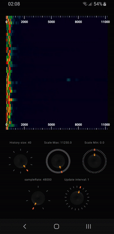

#  Real Time audio Spectrogram

A Jetpack Compose component for displaying real-time audio spectrograms on Android, built for audio signal visualization and debugging.
Ideal for signal processing, acoustic experiments, or retro audio interfaces.

## 🎯 Purpose

`RealTimeSpectrogram` renders a scrolling time-frequency map that visualizes the energy distribution of incoming audio frames across frequency bins in real time. It’s particularly useful in audio tools involving:

- FSK signal analysis
- Acoustic frequency monitoring
- Synth and tone visualization
- Audio debugging and UI feedback

## 🚀 Features

- 🔄 **Real-time rendering** of FFT data as a dynamic color grid
- 🎨 **Customizable color mapping** (from low to high intensity)
- 🕓 **Horizontal scrolling buffer**: recent FFT frames are pushed from right to left
- ⚡ **Lightweight and efficient**: uses `Canvas` drawing inside Compose
- 🎛️ **Fully configurable resolution**:
  - Number of FFT bins (vertical resolution)
  - Time steps (horizontal resolution)
- 💡 Supports optional normalization and intensity scaling

---

## 📸 Screenshots

| Musique demo | Tone 5000hz | Ultrasound 20Khz |
|:---:|:---:|:---:|
|  |  |   |

---

## 📐 Default Resolution & FFT Settings

By default, the component is configured with:

- **FFT size**: `512`
- **Sample rate**: `48000 Hz`

This provides a frequency resolution of:

48000 / 512 = **93.75 Hz** per frequency bin

Each horizontal slice of the spectrogram therefore represents ~94 Hz of bandwidth.

You can increase resolution by using a larger FFT size (e.g. `1024`, `2048`), which allows for finer frequency detail (e.g. 46.9 Hz or 23.4 Hz/bin respectively).  
**However**, note that increasing the FFT size also increases the time window per frame, making the spectrogram update more slowly and reducing time resolution.

Choose your FFT size based on the tradeoff between frequency precision and real-time responsiveness.

> 🔁 The **time resolution** of the spectrogram depends on how fast you can push new FFT frames — which is determined by both `FFT size` *and* `sample rate`.

Increasing the **sample rate** (e.g. going from `44100 Hz` to `48000 Hz` or more) can **improve visual smoothness** at high FFT sizes, since frames are processed faster in real time.  
That said, it also increases CPU load and the amount of data per second to handle.

---

### ⚖️ Finding the Right Balance

The visual quality and responsiveness of the spectrogram depends on tuning **three key parameters**:

- 🧮 **FFT size**: affects frequency precision (horizontal resolution in vertical flow spectrogram)
- 🎛 **Sample rate**: affects how fast frames are processed
- 🕓 **Spectrogram history**: controls how many past frames are shown (vertical span)

There’s no one-size-fits-all:  
**Choose the right combo depending on your needs** (e.g. FSK decoding, audio art, live display).

---

## 📊 FFT Size vs Frequency Resolution

| FFT Size | Frequency Resolution (Hz/bin) | Time Window (ms) | Description                          |
|----------|-------------------------------|------------------|--------------------------------------|
| 256      | 187.5 Hz                      | ~5.3 ms          | Very fast, but low frequency detail  |
| 512      | 93.75 Hz                      | ~10.6 ms         | ⚙️ Default — good balance             |
| 1024     | 46.88 Hz                      | ~21.3 ms         | Better frequency accuracy            |
| 2048     | 23.44 Hz                      | ~42.6 ms         | High resolution, slower updates      |
| 4096     | 11.72 Hz                      | ~85.3 ms         | Ultra fine detail, very sluggish     |

> 🧠 **Formulas**:
> - `Frequency Resolution = SampleRate / FFTSize`
> - `Time Window = FFTSize / SampleRate`

🧭 **Quick take**:
- Use **larger FFT sizes** for better frequency discrimination (e.g. FSK tones, harmonics).
- Use **smaller FFT sizes** for more responsive real-time visuals.
- Adjust the **sample rate** if needed to optimize performance.

## 🧱 Architecture

- Accepts audio data as a list of `FloatArray` representing FFT magnitudes
- Internally buffers recent FFT frames into a rolling matrix
- Each column = one FFT frame over time
- Each row = one frequency bin
- Color is mapped based on magnitude per pixel
- Uses `drawIntoCanvas` and `ImageBitmap` for performant rendering

## 🛠️ Integration

This component is designed to be driven by a real-time FFT pipeline, typically provided by a `AudioTrack` data record. 

## 📦 Dependencies

- Jetpack Compose (Canvas, ImageBitmap, Modifier)
- No external libraries — pure Kotlin

## 🧪 Typical Use Cases

- Live display of spectral energy in audio experiments
- Visual feedback for sound synthesis tools
- Debugging FSK encoders/decoders
- Educational apps involving acoustic waveforms
